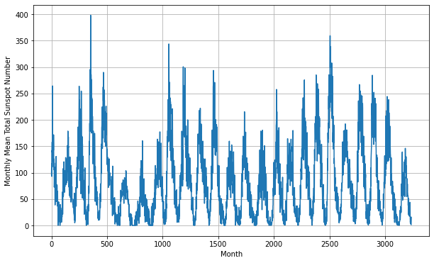
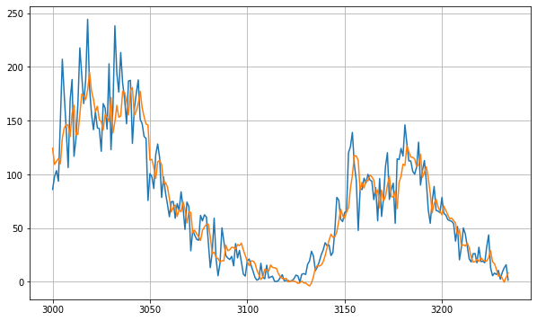

# GemCity-ML-AL_Random
## Gem City Tech: July 21 Talk
## Evelyn J. Boettcher

Using ML-AI to test the randomness of a python random number generator.

Since this is our first meetup, I thought I would embrace the randomness.
Going to work through a CoLab workbook that will test various random / pseudo 
random generators to see if we can predict the next number.

## Why

Having a truly random number generator is important.  
What you are using may not be that random, and you should test it.
Also, we all get tempted to find patterns in noise.  
So we will look at noise and hope that when we see noise in our data 
we will try to avoid fitting an algorithm to it.

## First Meeting Outline

* Introductions
* Sponsors
* Pizza and drinks
* Random tutorial
* Open Discussion (seed topics)
   * What do you want to see next week
   * What do you want to in this meetup
   * Second round of introductions
   * What new tools/toys are you playing with?

## Introduction
I am, Evelyn Boettcher, and I am a physicist and have been doing machine learning on and off again before Tensorflow has been around.  There is not currently a ML/AI or even a data science /visualization around Dayton and I thought that needed to change so I asked Allen if I could host a ML/AI group under Gem City Tech.

Allen May is the main Gem City Tech leader.  Gem City Tech is a family of user groups bringing tech-focused content to the Dayton Ohio community. There calendar is filled with opportunities to learn and share information 'about all things tech'.

Join us on our Discord server: https://discord.gg/nyDtEytbt6

### Gem City ML / AI Sponsors 

| Gem City Tech | The Hub |
| :--: | :--: |
| .svg) | .jpg)

* GemCity TECH: [GemCity.Tech](https://Gemcity.tech)
* The Innovation Hub: [thehubdayton.com](https://www.thehubdayton.com/)

An upcoming sponsor:
* Technology First: [www.technologyfirst.org](https://www.technologyfirst.org/)

### Calendar Events
* Gem City Tech: Third Thursday at 6.
* The GemCity TECH Meetup calendar of upcoming events: [www.meetup.com/gem-city-tech](https://www.meetup.com/gem-city-tech/events/calendar/)
* [The Technology First events calendar](https://www.technologyfirst.org/Technology-First-Events?EventViewMode=1&EventListViewMode=2&SelectedDate=8/20/2022&CalendarViewType=1)

## Intro to Random Numbers and ML
When I went through the tutorial: 
[Deeplearning-AI worksheet on fitting Sun Spot data with timeseries](https://github.com/https-deeplearning-ai/tensorflow-1-public/blob/main/C4/W4/ungraded_labs/C4_W4_Lab_3_Sunspots_CNN_RNN_DNN.ipynb),  
I was shocked that they wanted to fit to the "noise" and where getting so close of a 
fit with what looked like "random" noise. That got me thinking, can I use TensorFlow F
to see if the random number generator that I am using is truely random.  

|  |
| :--:  |
| Sun Spot data |

|  |
| :--:  |
| Sun Spot data with TF predictions |

### Let's play.

First let's walk through the sunspots tutorial.  Then we can play with numpy's and python's random generator.
Please go to [Random-Num-Testing.ipynb](Random-Num-Testing.ipynb)
   

